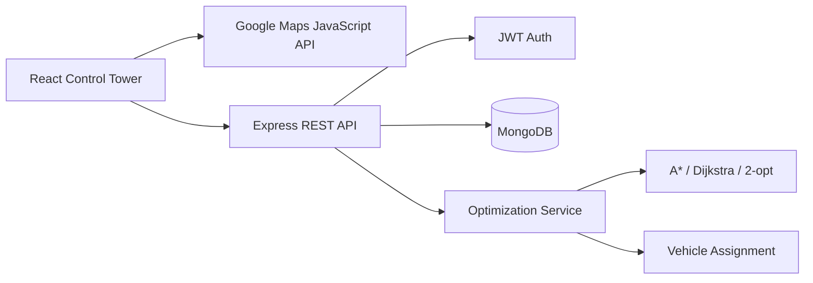

<div align="center">


<p>Real-time fleet intelligence for faster, smarter last-mile delivery.</p>

<a href="https://github.com/gokul2006-gs/FLEET_MANAGEMENT_SYSTEM/stargazers"></a>
<a href="https://github.com/gokul2006-gs/FLEET_MANAGEMENT_SYSTEM/issues"></a>


</div>

## The Mission

SmartRoute is an operations control tower for delivery teams. It combines live fleet visibility, authenticated workflows, route planning, and practical optimization algorithms in one focused interface.

<div align="center">

```text
Orders  ──▶  Route graph  ──▶  A* / Dijkstra  ──▶  2-opt  ──▶  Driver-ready routes
   │              │                  │               │
   └──────────────┴────────────── Analytics ─────────┘
```

</div>

## What Moves

| Control Tower | Optimization Lab | Fleet Operations |
| --- | --- | --- |
| Google Maps live views | Dijkstra and A* | Orders and time windows |
| Vehicle markers and routes | Nearest Neighbor sequencing | Drivers and vehicles |
| Notifications and alerts | 2-opt route improvement | Capacity-aware assignment |
| Analytics dashboards | Algorithm benchmarking | JWT-protected API |

## Stack

**Frontend** React, Vite, Tailwind CSS, React Router, Google Maps JavaScript API, Recharts, Framer Motion, Zustand

**Backend** Node.js, Express, MongoDB, Mongoose, JWT, bcrypt, Jest, Supertest

## Quick Start

### Requirements

- Node.js 18 or newer
- MongoDB local or MongoDB Atlas
- Google Cloud project with **Maps JavaScript API** enabled

### 1. Start the API

```powershell
cd backend
copy .env.example .env
npm install
npm run dev
```

The API runs at `http://localhost:5000`.

### 2. Configure and start the frontend

Add your values to `frontend/.env`:

```env
VITE_API_URL=http://localhost:5000/api
VITE_GOOGLE_MAPS_API_KEY=your_browser_restricted_key
```

Then run:

```powershell
cd frontend
npm install
npm run dev
```

Open `http://localhost:5173`.

<details>
<summary><strong>Optional: seed demo data</strong></summary>

```powershell
cd backend
npm run seed
```

</details>

## Architecture



## Project Layout

```text
smart-route/
├── frontend/              # React + Vite control tower
│   └── src/pages/         # Dashboard, maps, operations, analytics
├── backend/               # Express API and route algorithms
│   ├── src/algorithms/    # Graph search and route optimization
│   ├── src/controllers/   # API behavior
│   └── tests/             # Jest and Supertest coverage
├── README.md
└── .gitignore
```

## Algorithms

- **Dijkstra** for guaranteed shortest paths
- **A*** for heuristic-guided routing
- **Nearest Neighbor** for fast multi-stop sequencing
- **2-opt** for removing inefficient route crossings
- **Vehicle assignment** with capacity constraints
- **Haversine distance** for geographic calculations

## Scripts

| Location | Command | Purpose |
| --- | --- | --- |
| `backend` | `npm run dev` | Start API with nodemon |
| `backend` | `npm test` | Run backend tests |
| `backend` | `npm run seed` | Load demo data |
| `frontend` | `npm run dev` | Start Vite development server |
| `frontend` | `npm run build` | Create production build |

## Deployment

### Backend on Render

1. Create a new **Web Service** on [Render](https://render.com) and connect this repository.
2. Set **Root Directory** to `backend`.
3. Set **Runtime** to `Node`.
4. Set **Build Command** to `npm install`.
5. Set **Start Command** to `npm start`.
6. Add these environment variables in Render:

```env
MONGODB_URI=your_mongodb_atlas_connection_string
JWT_SECRET=replace_with_a_long_random_secret
CLIENT_URL=https://your-vercel-domain.vercel.app
NODE_ENV=production
```

Render provides `PORT` automatically. After deployment, verify:
`https://your-render-service.onrender.com/api/health`.

Before deploying, allow Render to connect in MongoDB Atlas under **Network Access**. For a quick setup, add `0.0.0.0/0`, then restrict access later when your production network is known.

### Frontend on Vercel

1. Import the same repository into [Vercel](https://vercel.com).
2. Set **Root Directory** to `frontend`.
3. Vercel detects Vite automatically. Use `npm run build` as the build command and `dist` as the output directory.
4. Add these environment variables for **Production**:

```env
VITE_API_URL=https://your-render-service.onrender.com/api
VITE_GOOGLE_MAPS_API_KEY=your_browser_restricted_key
```

5. Deploy, copy the Vercel domain, update Render's `CLIENT_URL`, and redeploy the backend.

Restrict the Google Maps browser key to your Vercel domain, for example:
`https://your-vercel-domain.vercel.app/*`.

Do not upload `.env` files or expose `MONGODB_URI` and `JWT_SECRET` in Vercel. Only `VITE_*` values belong in the frontend deployment.

<div align="center">

<br />


</div>
